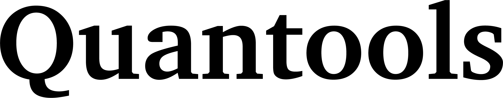
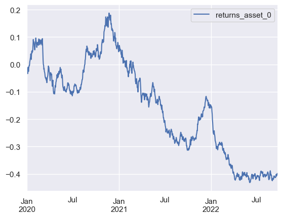
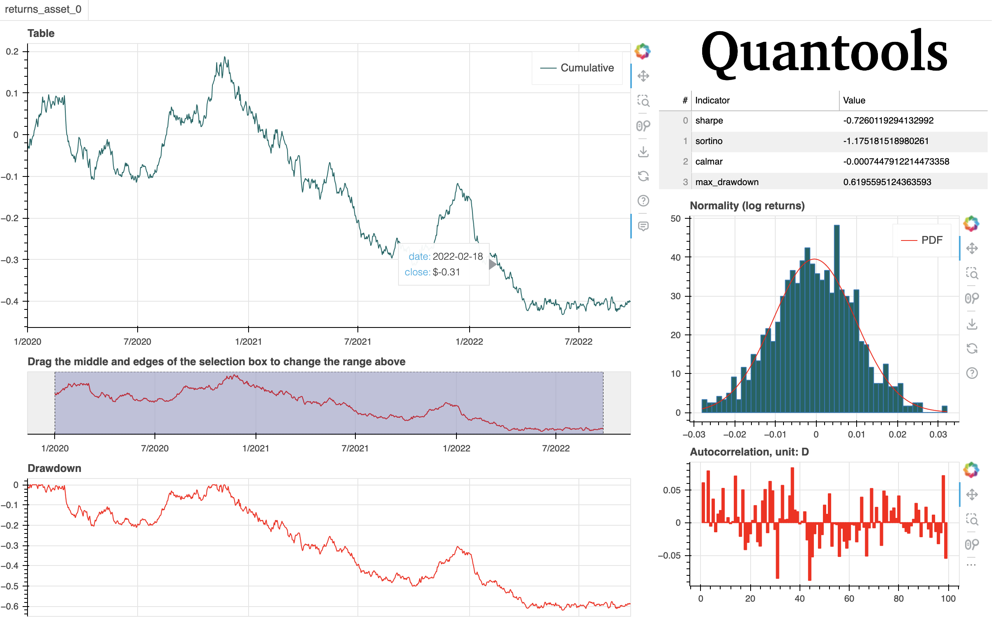

<h1 align="center">
  <br/>
</h1>


<p align="center">Quantools is a Python3.11 library for quantitative tasks </p>


<p align="center">
<a href="https://github.com/g0bel1n/quantools/actions/workflows/testing.yml" 
target="_blank"></a>

<!--  -->


<a href="https://www.python.org/downloads/release/python-390/" 
target="_blank"></a>
</p>

```python
import quantools as qt

X = qt.generate_brownian_returns(1, 1000, drift=0, vol=1e-2)

# X is a Table object

```

You can get some indicators:

```python
X.calmar(risk_free = .05)
X.sharpe()
X.cumulative()
...
```

You can plot the results :
```python
X.plot()
```
<h1 align="center">
  <br/>
</h1>


or autoplot it :

```python
X.autoplot()
```
<h1 align="center">
  <br/>
</h1>


You can transform your data:


```python

X.stationnarize(inplace=True) #Fractionnal differentiation
X.normalize()
```


## TODO : add test for plotting, sharpe, calmar etc 